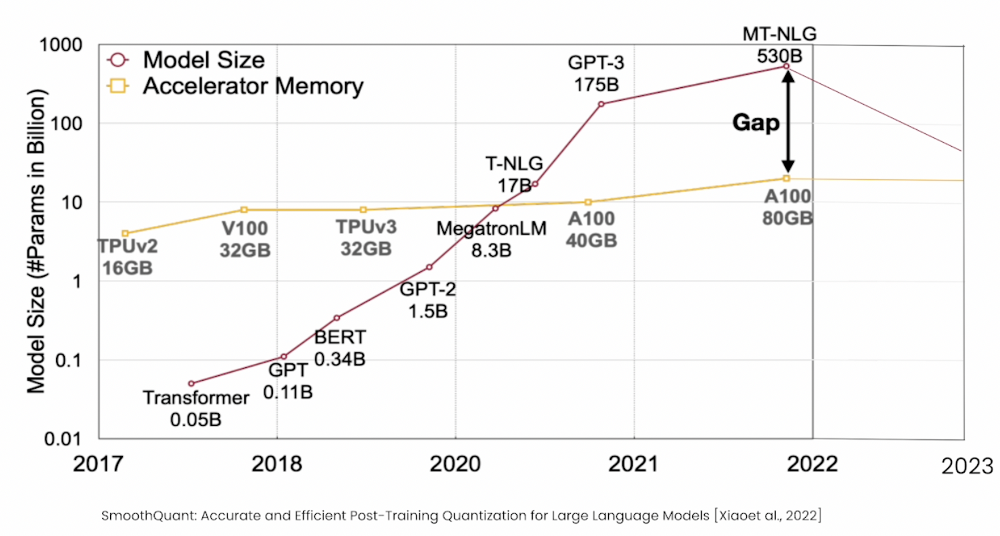

# Quantization

Models keep getting bigger. To keep cost of inference low, we need novel ways to compress models.

<center> </br>
</center>


Ways to compress models:

1. Pruning: Remove layers in a model that do not improve the model. For example, remove layers that have weights close to zero. Pruned models can have accuracy concerns.
2. Knowledge Distillation: Train a smaller student model to emulate the larger teacher model. Can be computationally challenging for large models.
3. Quantization: Compress a model with weight is fp32 precision to lower precision such as int8 without losing accuracy.

Next we will deep dive into Quantization theory and different ways to quantize models.

## Data Types

1. FP32: Uses 4 bytes to store a parameter
2. INT8: Uses 1 byte to store a parameter

```
>>> import numpy as np
>>> number = 3.14159265359
>>> fp32_number_np = np.float32(number)
>>> print("NumPy:", fp32_number_np)
NumPy: 3.1415927
>>> int8_number = np.int8(number)
>>> print(int8_number)
3
>>>
```


## How to quantize models post-training to accelerate inference?

## What is quantization?


## Quantization basics?


## Quantization methods?


## Evaluating quantization methods


## Resources

1. [A Visual Guide to Quantization](https://newsletter.maartengrootendorst.com/p/a-visual-guide-to-quantization) 
2. [Quantization Fundamentals with Hugging Face](https://learn.deeplearning.ai/courses/quantization-fundamentals/lesson/1/introduction)
3. [Quantization in Depth](https://www.deeplearning.ai/short-courses/quantization-in-depth/)
4. [How Fireworks evaluates quantization precisely and interpretably](https://fireworks.ai/blog/fireworks-quantization)
