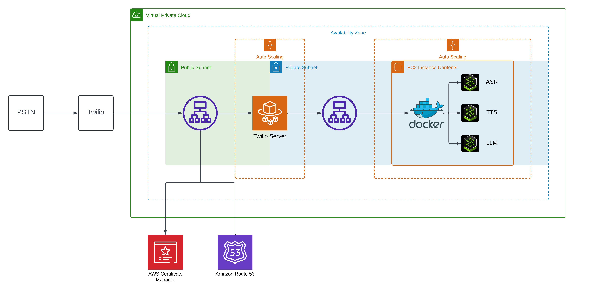
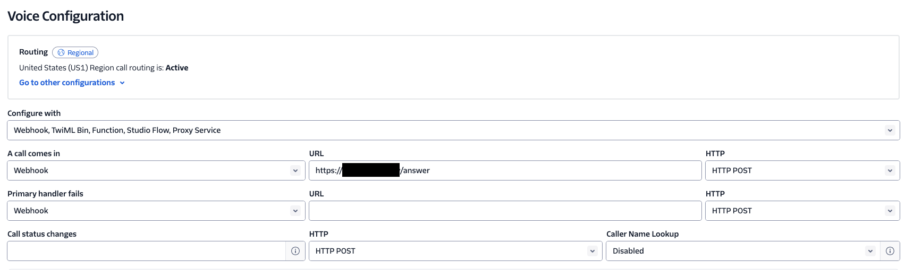
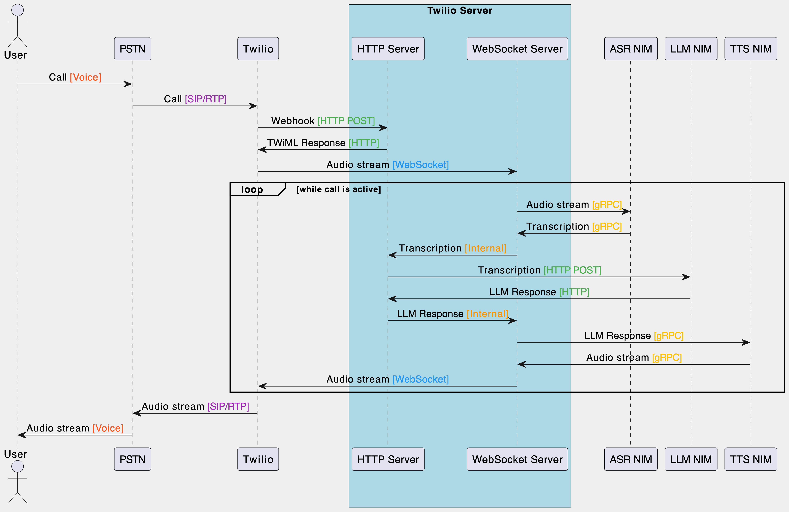

# NIM Voice Bot with Twilio

This project implements a NIM Voice Bot using Twilio and deployed with AWS CDK, integrating various services such as EC2, ECS, and Lambda for a comprehensive voice interaction system.

## Architecture Overview



The architecture consists of the following main components:

1. **PSTN**: Public Switched Telephone Network for incoming calls.
2. **Twilio**: Handles the voice communication and interfaces with the AWS infrastructure.
3. **AWS VPC**: Contains the following components:
   - Public Subnet: Hosts the Application Load Balancer.
   - Private Subnet: Contains the Twilio Server (ECS Fargate).
   - EC2 Instance: Runs Docker containers for ASR (Automatic Speech Recognition), TTS (Text-to-Speech), and LLM (Large Language Model).
4. **Auto Scaling**: Manages the scaling of EC2 instances and ECS tasks.
5. **AWS Certificate Manager**: Manages SSL/TLS certificates.
6. **Amazon Route 53**: Handles DNS routing.

## Prerequisites

- AWS Account
- Twilio Account
- Docker
- Node.js and npm/yarn
- AWS CDK CLI

## Deployment Instructions

1. Clone the repository and navigate to the project directory.

2. Install dependencies:
   ```
   yarn
   ```

3. Create a `.env` file in the root directory with the following contents:

   ```
   TWILIO_HOST_NAME=<your-twilio-hostname>
   NIM_HOST_NAME=<your-nim-hostname>
   DOMAIN_NAME=<your-domain-name>
   TWILIO_AUTH_TOKEN=<your-twilio-auth-token>
   NGC_API_KEY=<your-ngc-api-key>
   CAPACITY_RESERVATION_ID=<your-capacity-reservation-id>
   AWS_REGION=<your-aws-region>
   VENDOR_NAME=<your-vendor-name>
   CONTAINER_NAME=<your-container-name>
   CONTAINER_TAG=<your-container-tag>
   ```

   For example:

   ```
   NIM_HOST_NAME=nim
   DOMAIN_NAME=example.com
   TWILIO_AUTH_TOKEN=axxxxxxxxxxxxxxx
   NGC_API_KEY=nvapi-xxxxxxxxxxxxxxxxxxxxxxxx
   CAPACITY_RESERVATION_ID=cr-xxxxxxxxxxxxxxxxxxxxxxxx
   AWS_REGION=us-east-2
   VENDOR_NAME=meta
   CONTAINER_NAME=llama-3.1-8b-instruct
   CONTAINER_TAG=1.1.2
   ```

4. Upload secrets to AWS Secrets Manager:

   ```
   yarn upload-secrets
   ```
   This script will upload the `TWILIO_AUTH_TOKEN` and `NGC_API_KEY` to AWS Secrets Manager.  We will use the `TWILIO_AUTH_TOKEN` to allow Twilio as part of the security within our Twilio Server and the `NGC_API_KEY` to allow our deployed instance to download the NGC container image.


5. Deploy the CDK stack:

   ```
   yarn launch
   ```

   This command will synthesize the CloudFormation template and deploy the stack to your AWS account.

6. Update Twilio

Create a Twilio phone number and point the webhook to the `TWILIO_HOST_NAME` and `DOMAIN_NAME` in the `.env` file.  For example: `https://voice.yourdomain.com/answer`.  Where `voice` is your `TWILIO_HOST_NAME` and `yourdomain.com` is your `DOMAIN_NAME`.



## Main Components

1. **VPC Resources**: Defined in `src/vpc.ts`, sets up the VPC, subnets, and security groups.
2. **Certificate Resources**: Defined in `src/certificate.ts`, manages SSL/TLS certificates.
3. **ECS Resources**: Defined in `src/ecs.ts`, sets up the ECS cluster, task definitions, and services for the Twilio server.
4. **EC2 Resources**: Defined in `src/ec2.ts`, manages EC2 instances for running Docker containers (ASR, TTS, LLM).

### EC2 Configuration

As part of the deployment we will create an Auto Scaling Group (ASG) with an EC2 instance.  The ASG will be configured to launch an EC2 instance with the necessary Docker containers for ASR, TTS, and LLM.  The EC2 instance will be configured with the necessary security groups to allow communication with the VPC and the ECS service.  This deployment also uses a capacity reservation to ensure that the EC2 instance deploys on a P5 instance type in the region you have reserved capacity.  

### EC2 User Data

The EC2 instance will have a user data script that will configure the EC2 instance with the necessary Docker containers for ASR, TTS, and LLM.  

#### Drivers and NVIDIA Container Toolkit
```bash
# Update and install dependencies
log_message "Updating package lists and installing dependencies"
apt-get update
apt-get install -y gcc unzip python3-pip

# Install AWS CLI
log_message "Installing AWS CLI"
curl "https://awscli.amazonaws.com/awscli-exe-linux-x86_64.zip" -o "awscliv2.zip"
unzip awscliv2.zip
./aws/install

# Install NVIDIA drivers and CUDA toolkit
log_message "Installing NVIDIA drivers and CUDA toolkit"
wget https://developer.download.nvidia.com/compute/cuda/repos/ubuntu2204/x86_64/cuda-keyring_1.1-1_all.deb
dpkg -i cuda-keyring_1.1-1_all.deb
apt-get update
apt-get install -y cuda-toolkit-12-6 nvidia-open

# Install Docker
log_message "Installing Docker"
apt-get install -y apt-transport-https ca-certificates curl software-properties-common
curl -fsSL https://download.docker.com/linux/ubuntu/gpg | apt-key add -
add-apt-repository "deb [arch=amd64] https://download.docker.com/linux/ubuntu $(lsb_release -cs) stable"
apt-get update
apt-get install -y docker-ce docker-ce-cli containerd.io

# Install NVIDIA Container Toolkit
log_message "Installing NVIDIA Container Toolkit"
curl -fsSL https://nvidia.github.io/libnvidia-container/gpgkey | gpg --dearmor -o /usr/share/keyrings/nvidia-container-toolkit-keyring.gpg
curl -s -L https://nvidia.github.io/libnvidia-container/stable/deb/nvidia-container-toolkit.list | \
    sed 's#deb https://#deb [signed-by=/usr/share/keyrings/nvidia-container-toolkit-keyring.gpg] https://#g' | \
    tee /etc/apt/sources.list.d/nvidia-container-toolkit.list
apt-get update
apt-get install -y nvidia-container-toolkit
apt-get install cuda-drivers-fabricmanager-560 -y
systemctl enable nvidia-fabricmanager
systemctl start nvidia-fabricmanager
```

#### NIM Setup
```bash
# Configure Docker to use NVIDIA runtime
log_message "Configuring Docker to use NVIDIA runtime"
nvidia-ctk runtime configure --runtime=docker
systemctl restart docker

# Retrieve NGC API Key from Secrets Manager
log_message "Retrieving NGC API Key from Secrets Manager"
NGC_API_KEY=$(aws secretsmanager get-secret-value --secret-id NGC_API_KEY --query SecretString --output text --region ${Stack.of(this).region})

# Create cache directory
log_message "Creating cache directory"
mkdir -p /home/ubuntu/.cache/nim
chown ubuntu:ubuntu /home/ubuntu/.cache/nim

# Login to NGC
log_message "Logging in to NGC"
echo $NGC_API_KEY | docker login nvcr.io -u '$oauthtoken' --password-stdin
```

### NIM Containers
```bash
# Run the NIM container
log_message "Running the NIM container"
docker run -d --restart unless-stopped --name=${props.containerName} \
  --runtime=nvidia \
  --gpus "device=0,1,2,3" \
  -e NGC_API_KEY=$NGC_API_KEY \
  -e CONTAINER_PROFILE=tensorrt_llm-h100-fp8-tp2-latency \
  -v "/home/ubuntu/.cache/nim:/opt/nim/.cache" \
  -u $(id -u ubuntu) \
  -p 8000:8000 \
  nvcr.io/nim/${props.vendorName}/${props.containerName}:${props.containerTag}

# Run the ASR container
log_message "Running the ASR container"
export CONTAINER_NAME_ASR=parakeet-ctc-1.1b-asr
docker run -d --restart unless-stopped --name=$CONTAINER_NAME_ASR \
  --runtime=nvidia \
  --gpus "device=6" \
  -e NGC_API_KEY=$NGC_API_KEY \
  -e NIM_MANIFEST_PROFILE=7f0287aa-35d0-11ef-9bba-57fc54315ba3 \
  -e NIM_HTTP_API_PORT=9000 \
  -e NIM_GRPC_API_PORT=50051 \
  -p 9000:9000 \
  -p 50051:50051 \
  nvcr.io/nim/nvidia/parakeet-ctc-1.1b-asr:1.0.0

# Run the TTS container
log_message "Running the TTS container"
export CONTAINER_NAME_TTS=fastpitch-hifigan-tts
docker run -d --restart unless-stopped --name=$CONTAINER_NAME_TTS \
  --runtime=nvidia \
  --gpus "device=7" \
  --shm-size=8GB \
  -e NGC_API_KEY=$NGC_API_KEY \
  -e NIM_MANIFEST_PROFILE=bbce2a3a-4337-11ef-84fe-e7f5af9cc9af \
  -e NIM_HTTP_API_PORT=9001 \
  -e NIM_GRPC_API_PORT=50052 \
  -p 9001:9001 \
  -p 50052:50052 \
  nvcr.io/nim/nvidia/fastpitch-hifigan-tts:1.0.0
```

With this User Data script, we configure the EC2 instance with the necessary drivers and NVIDIA Container Toolkit.  We then login to NGC to retrieve the NGC API Key and configure Docker to use the NVIDIA runtime.  We then create a cache directory for the NIM containers and login to NGC to retrieve the NGC API Key.  We then start the LLM, ASR, and TTS containers.  All three will be running on the EC2 instance on different ports and GPUs.  These endpoints will be exposed to the VPC via an Application Load Balancer that is terminating the SSL/TLS traffic.  The Application Load Balancer will route the traffic to the appropriate NIM container.


### Parakeet Riva ASR NIM
More information can be found here:
https://catalog.ngc.nvidia.com/orgs/nvidia/teams/nim/collections/parakeet-ctc-riva-0-6b

### Fastpitch Hifigan TTS NIM
More information can be found here:
https://catalog.ngc.nvidia.com/orgs/nvidia/teams/nim/collections/fastpitch-hifigan-tts

### Meta Llama 3.1 8b NIM
More information can be found here:
https://catalog.ngc.nvidia.com/orgs/nvidia/teams/nim/collections/meta-llama-3-1-8b-instruct

## Call Flow



### Twilio Server

The Twilio Server is a Python based FastAPI application that will handle the incoming calls from Twilio.  Using BiDrectional Streaming, the Twilio Server will use TWiML to direct a WebSocket connection to itself.  This WebSocket server will consume the audio stream from Twilio and send it to the NIM container for ASR.  Once the transcription is returned, the Twilio Server will send the transcription to the Meta Llama 3.1 8b NIM container for tool calling.  In this example, we are trying to order a pizza.  The response from the LLM will be sent back to the Twilio Server which will use the TTS container to convert the text to speech and then send the audio back to Twilio to play to the caller.

### TWiML redirection to WebSocket
```python
@app.post("/answer")
async def answer_call(request: Request):
    response = VoiceResponse()
    connect = Connect()
    connect.stream(url=f'wss://{request.headers["host"]}/ws')
    response.append(connect)
    logger.info(f"Sending TwiML response: {response}")
    return StreamingResponse(iter([str(response)]), media_type="application/xml")
```

### WebSocket Server

Once we have the audio streaming to the WebSocket server, we will process the audio in chunks and deliver to the ASR via gRPC.  We will use the Parakeet Riva ASR NIM container to perform the ASR.  

```python
    def recognition_thread_func(self, stop_event):
        responses = asr_service.streaming_response_generator(
            audio_chunks=self.audio_generator(stop_event),
            streaming_config=self.config
        )
        for response in responses:
            for result in response.results:
                is_final = result.is_final
                transcript = result.alternatives[0].transcript if result.alternatives else ""
                confidence = result.alternatives[0].confidence if result.alternatives else 0.0
                
                log_level = logging.INFO if is_final else logging.DEBUG
                logger.log(log_level, f"{'Final' if is_final else 'Interim'} transcript: {transcript}")
                
                self.result_queue.put({
                    "event": "transcription",
                    "is_final": is_final,
                    "text": transcript,
                    "confidence": confidence
                })
```
### Conversation Manager

When we have a final result from the ASR, we will send the result to the LLM container for tool calling.  

```python
                    if result['is_final']:
                        llm_response = await self.handle_final_transcript(result)

                        if tts_task and not tts_task.done():
                            tts_task.cancel()
                        self.bot_speaking = True
                        self.bot_speaking_start_time = time.time()
                        logger.info("Bot started speaking")
                        self.log_speaking_status()
                        tts_task = asyncio.create_task(self.tts_streamer.send_tts_response(llm_response, self.stream_sid))
                        await tts_task
```

### Tool Calling

The prompt used to process the pizza order is a complex prompt that uses Llama 3.1 8b tools use.  More information can be found here: https://www.llama.com/docs/model-cards-and-prompt-formats/llama3_1/#json-based-tool-calling

```python
tools = [
    {
        "type": "function",
        "function": {
            "name": "process_pizza_order",
            "description": "Process a pizza order with the given details",
            "parameters": {
                "type": "object",
                "properties": {
                    "size": {
                        "type": "string",
                        "description": "The size of the pizza",
                        "enum": PIZZA_SIZES
                    },
                    "toppings": {
                        "type": "array",
                        "items": {
                            "type": "string",
                            "enum": PIZZA_TOPPINGS
                        },
                        "description": "List of toppings for the pizza"
                    },
                    "crust": {
                        "type": "string",
                        "description": "The type of crust for the pizza",
                        "enum": CRUST_TYPES
                    }
                },
                "required": ["size", "toppings", "crust"]
            }
        }
    }
]

role_prompt = """Environment: pizza_ordering
Tools: process_pizza_order
Cutting Knowledge Date: December 2023
Today Date: [Current Date]

# Tool Instructions
- When you have gathered all necessary information for a pizza order, use the process_pizza_order function.

You have access to the following function:

Use the function 'process_pizza_order' to: Process a pizza order with the given details
{tool_json}

You must use the following function and the reply should contain the function call in the following format:
<{{start_tag}}={{function_name}}>{{parameters}}{{end_tag}}
where

start_tag => `<function`
parameters => a JSON dict with the function argument name as key and function argument value as value.
end_tag => `</function>`

Here is an example,
<function=process_pizza_order>{{"size": "medium", "toppings": ["cheese", "pepperoni"], "crust": "thin"}}</function>

Reminder:
- Function calls MUST follow the specified format
- Required parameters MUST be specified
- Only call one function at a time
- Put the entire function call reply on one line

You are a friendly, conversational AI assistant helping a caller order a pizza over the phone. 
Your task is to gather all necessary information for a pizza order, including size, toppings, and crust type.
Keep responses concise and natural. If the user doesn't provide all necessary details, ask for the missing information. Only ask one question at a time.
Don't mention the function or expose its usage to the user."""
```

The LLM processing we are doing here does not need to be a tool calling.  This demo could be configured with any LLM prompt to provide interactive, conversational experiences.  

### TTS Generation

Once we have a response from the LLM, we will use the Fastpitch Hifigan TTS NIM container to convert the text to speech.  We will then stream the audio back to Twilio to play to the caller.

```python
        responses = tts_service.synthesize_online(
            text,
            voice_name=voice_name,
            encoding=AudioEncoding.LINEAR_PCM, 
            language_code=language_code,
            sample_rate_hz=sample_rate_hz,
        )
        
        for response in responses:
            mulaw_audio = audioop.lin2ulaw(response.audio, 2)
            yield mulaw_audio
            await asyncio.sleep(0.01)
```

The response from the TTS generation is a raw LINEAR_PCM audio stream that we can send to Twilio.

### TTS Streaming

```python
    async def stream_tts(self, tts_stream, stream_sid):
        try:
            # Send bot_speaking_start mark
            await self.send_mark(stream_sid, "bot_speaking_start")
            self.tts_start_time = time.time()

            async for audio_chunk in tts_stream:
                if not self.is_speaking:
                    logger.info("TTS audio stream interrupted")
                    break
                base64_audio = base64.b64encode(audio_chunk).decode('utf-8')
                await self.websocket.send_json({
                    "event": "media",
                    "streamSid": stream_sid,
                    "media": {
                        "payload": base64_audio
                    }
                })
                await asyncio.sleep(0.01)  # Small delay to control streaming rate

            # Send bot_speaking_end mark
            await self.send_mark(stream_sid, "bot_speaking_end")
            
            logger.info("Finished streaming TTS audio")
        except Exception as e:
            logger.exception(f"Error in stream_tts: {str(e)}")

    async def send_tts_response(self, text, stream_sid):
        logger.info(f"Generating TTS for: {text}")
        tts_stream = generate_tts_response(text, language_code="en-US", voice_name="English-US.Female-1")
        
        self.is_speaking = True
        
        await self.stream_tts(tts_stream, stream_sid)
```

With the TTS generated by our TTS NIM, we can stream the audio back to Twilio to play to the caller.


## Cleanup

To avoid incurring unnecessary costs, remember to destroy the stack when you're done:

```
yarn cdk destroy
```


